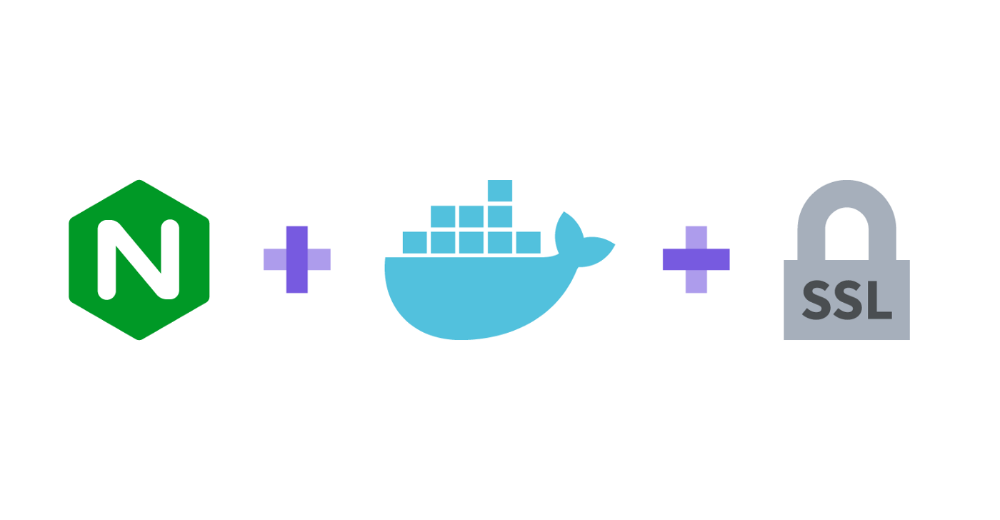
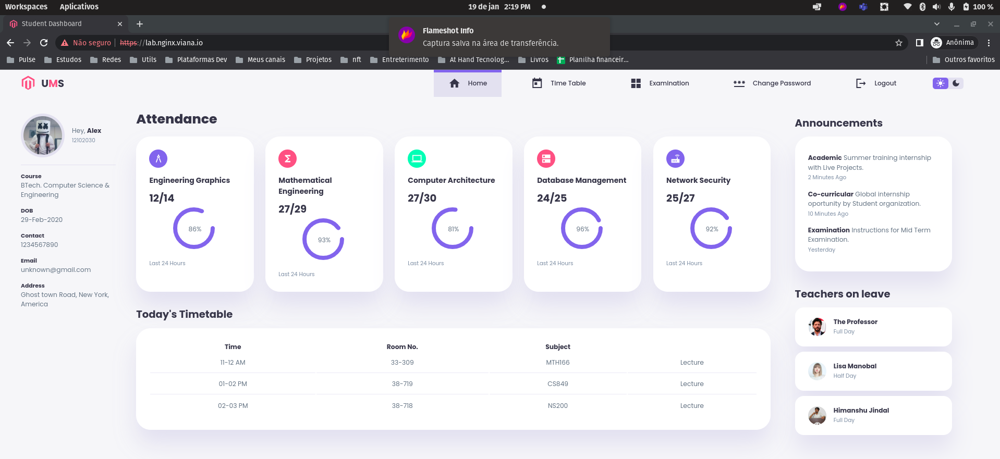
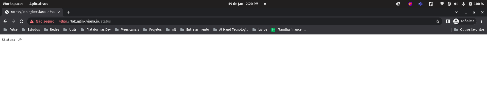

<h1 align="center">Docker - Nginx - SSL </h1>

<p align="center">
  
  
  
</p>

<p align="center">
  
</p>

## 🌱 Project

- Projeto laboratório para criar um certificado SSL autoassinado com OpenSSL e realização de teste com uma aplicação Nginx.

## ✨ Tecnologias

- Docker
- OPenSSL
- Shell Script
- DOcker Compose
- Nginx

## 🛠️ Etapas serem feitas

- [x] Criar Script para gerar os certificados [generate_certificates.sh](generate_certificates.sh)
- [x] Configurar um dns ficticio no /etc/hosts da máquina
  - Utilizei como exemplo o `127.0.0.1 lab.nginx.viana.io`
- [x] Criar e configura uma aplicação rodando no Nginx [App para exemplo](./src/README.md)
- [x] Criar nginx.conf [Example](./src/nginx.conf)
- [x] Dockerizar a aplicação [Dockerfile](./src/Dockerfile)
- [x] Criar docker-compose para subir o nginx [docker-compose.yml](./docker-compose.yml)

## ✨ Execução

- Criar certificados

```bash
bash generate_certificates.sh
```

- Subir o webserver com docker-compose

```bash
docker-compose up -d --build
```

- Acessando o serviço:

- Acessando a página inicial do serviço:
  - https://lab.nginx.viana.io

<p align="center">
  
</p>

- Verificando o estado do serviço:
  - https://lab.nginx.viana.io/status

<p align="center">
  
</p>

## 📄 Licença

Esse projeto está sob a licença MIT. Veja o arquivo [LICENSE](LICENSE) para mais detalhes.

## 🙇 Referências

- https://imasters.com.br/devsecops/como-criar-um-certificado-autoassinado-ssl-com-openssl
- https://thatdevopsguy.medium.com/how-to-create-a-static-web-server-for-html-with-nginx-99bf8226bce6